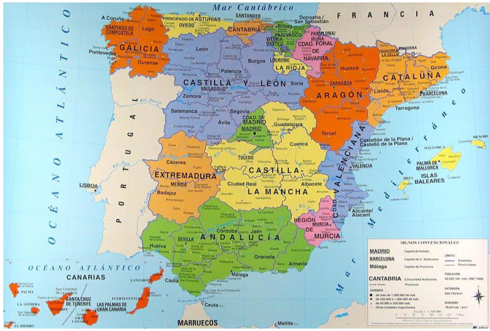
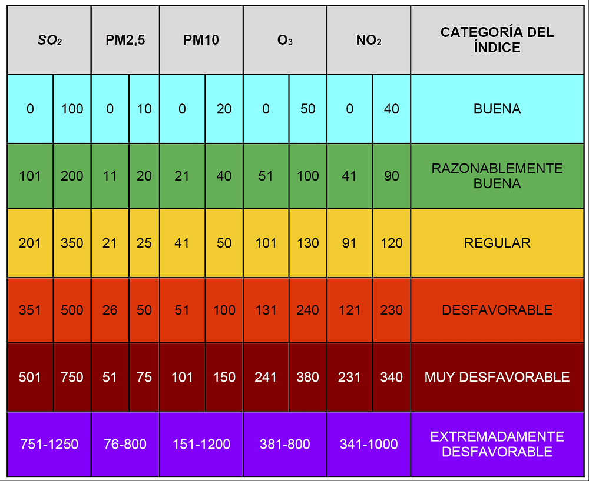

```{r setup, include=FALSE}
knitr::opts_chunk$set(echo = TRUE)
```

## Índice

I.  Objetivos
II. Comunidades Autónomas
III. Calidad del Aire
IV. Altas Hospitalarias
V.  Relación
VI. Conclusiones
VII. Bibliografía

## Objetivos

-   Averiguar y demostrar hasta qué punto están relacionadas la calidad del aire con la tasa de hospitalización.

-   Exponer los tipos de enfermedades que podrían estar causadas por la baja calidad del aire.

-   Explicar como se mide la calidad del aire y lo que podría influir a esta.

## Comunidades Autónomas

Comunidades Autónomas empleadas:

-   Palma de Mallorca - Mallorca

-   Gijón - Asturias

-   Cantabria - Cantabria

-   Valencia - Comunidad Valenciana

-   Madrid - Comunidad de Madrid



## Calidad del Aire

#### Introducción

La calidad del aire se puede definir como la concentración de contaminante que llega a un receptor, más o menos alejado de la fuente de emisión.

Para poder medir la calidad del aire, es necesario conocer el valor del índice de calidad del aire (ICA), que nos indica la contaminación atmosférica y los efectos para la salud.

#### Clasificación

El Índice de Calidad del Aire (ICA) define seis categorías de calidad del aire, cada una con su código de colores asociado, un nivel para la salud y el índice de la calidad del aire:

-   Verde: Buena para la salud (ICA de 0 a 50)

-   Amarillo: Moderada (ICA de 51 a 100)

-   Naranja: Dañina a la salud para grupos sensibles (ICA de 101 a 150)

-   Rojo: Dañina a la salud (ICA 151 a 200)

-   Morado: Muy dañina a la salud (ICA 201 a 300)

-   Marrón: Peligrosa (ICA superior a 300)

Para llevar a cabo el cálculo, se asigna la peor categoría de los contaminantes medidos en las estaciones de control de las redes de vigilancia. Estos contaminantes son:

-   Partículas en suspensión (PM~10~)

-   Ozono troposférico (O~3~)

-   Dióxido de nitrógeno (NO~2~)

-   Dióxido de azufre (SO~2~)

{width="457" height="312"}

## Altas Hospitalarias

#### Introducción

Para conocer los problemas de salud y la carga de enfermedad de la población, a parte de la mortalidad, podemos emplear la información de altas hospitalarias que proporcionan los servicios sanitarios y que permite conocer las enfermedades que han originado el mayor número de altas hospitalarias con internamiento.

En este caso, hemos obtenido un .xls que incluye las altas hospitalarias según:

-   Sexo

-   Diagnóstico principal

-   Provincia

-   Comunidad Autónoma

-   Ciudad Autónoma

En nuestro caso consideramos únicamente a los enfermos dados de alta que hayan ingresado en un centro hospitalario y permanecen, al menos, una noche. El diagnóstico es el diagnóstico principal que aparece en el informe de alta hospitalaria que recibe el paciente y que ha causado su ingreso; clasificándolo de acuerdo a la Clasificación Internacional de Enfermedades.

## Relación

## Conclusiones

Tras analizar la relación de los datos de las altas hospitalarias en función de las comunidades autónomas con la calidad del aire de cada una de ellas, analizando las enfermedades por separado:

En cuanto a enfermedades respiratorias y circulatorias:

-   El mayor número de altas se da en Cantabria, que a su vez, el la que presenta la mejor calidad del aire.

En cuanto a enfermedades osteoarticulares:

-   El mayor índice de altas es en Palma de Mallorca y el menor es en Valencia, teniendo ambas una calidad de aire en un rango similar (ICA: Razonablemente Buena).

En resumen, en estas tablas no hemos encontrado una relación evidente entre la calidad del aire de una comunidad y la salud de sus habitantes. Esto puede ser debido a que los datos que hemos seleccionado no sean los más adecuados porque no representan una población real, no hemos abarcado todas las magnitudes que definen la calidad del aire, o bien, la influencia del Covid-19, ya que el análisis lo hemos realizado con datos del año 2020, por lo que los resultados esperados pueden haberse visto afectados. Por lo tanto, los resultados que hemos obtenido tras este estudio no son aquellos que esperábamos.

## Bibliografía

<https://www.ine.es/>

<https://datos.gob.es/es/catalogo?tags_es=Aire>

<https://datos.gob.es/gl/catalogo/l01330241-calidad-de-aire-datos-ano-2020>

<https://www.fundacionaquae.org/wiki/como-se-mide-calidad-aire/>

<https://www.meteogalicia.gal/datosred/infoweb/caire/informes/MANUALES/ES/IT_31_CALCULO_DO_ICA.pdf>

This is an R Markdown document. Markdown is a simple formatting syntax for authoring HTML, PDF, and MS Word documents. For more details on using R Markdown see <http://rmarkdown.rstudio.com>.

When you click the **Knit** button a document will be generated that includes both content as well as the output of any embedded R code chunks within the document. You can embed an R code chunk like this:

```{r cars}
summary(cars)
```

## Including Plots

You can also embed plots, for example:

```{r pressure, echo=FALSE}
plot(pressure)
```

Note that the `echo = FALSE` parameter was added to the code chunk to prevent printing of the R code that generated the plot.
